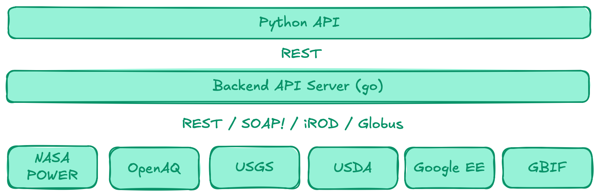

# Status Report&mdash;4 November 2025

__Task:__ Investigate data sources used by  [ENV-AGENTS](https://github.com/aparkin/env-agents/tree/main)

__Overall Goal:__ Facilitate use of ENV-AGENTS (and similar) source data for research applications __(in Python)__

## Status
- Investigated structure of Google Earth Engine Python API
- Began development of prototype Python package to support NASA POWER use case
  - Use to explore design options, estimate costs, allow user assessment of API
  - Can try it out by clokcking Binder badge on [prototype repo](https://github.com/cohere-llc/data-agents?tab=readme-ov-file#data-agents) or just click [here](https://mybinder.org/v2/gh/cohere-llc/data-agents/HEAD?filepath=examples/simple.ipynb)
  

## Options For External Data Sources
- Bulk data transfer
  - Beginning to look into bulk data transfer options for external data sources
- Python package backed by native web services
  - ENV-AGENTS-like structure

    - custom adapeters for each service with unified query syntax
    - data staged in local Jupyter environment
    - interactions via native REST APIs or Python packages

  - Google Earth Engine-like structure

    - backend server supporting python package
    - data staged on server
    - interactions via native REST APIs or bulk protocols
